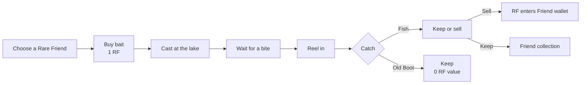
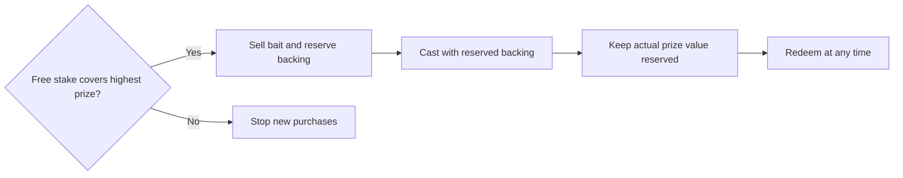

# Rare Friends: Fishing

## One-page game and economy design

### At a glance

| | Rule |
|---|---|
| Player | An owned, hardwired Rare Friends Generations NFT |
| Bait | 1 RF per cast |
| Result | Seven fish or one worthless boot |
| Fish sale | Fixed RF price at the bait vendor, with no expiry |
| Expected payout | 0.90 RF per cast |
| Vendor edge | **10%** |

## Game loop



- One bait always creates one result.
- Reeling adds tension but does not change the RF odds.
- Bait and catches belong to the Friend and transfer with its NFT. No activation or tier requirement.
- Kept fish retain their fixed redemption price indefinitely.
- Run the reference component with `npm run dev:game -- examples/fishing`. The SDK runtime supplies wallet connection, owned Friend selection, eligibility checks, sandbox isolation and confirmations.
- The owned Rare Friend moves through the world with keyboard/touch controls. The lake and bait vendor are interactable world locations; their menus support the world. No separate shop, collection, About or Store pages are required.

## Catch economy

| Catch | Class | Chance | Vendor price | EV |
|---|---|---:|---:|---:|
| Old Boot | Junk | 15% | 0 RF | 0.000 |
| Sardine | Common | 30% | 0.25 RF | 0.075 |
| Sunfish | Common | 22% | 0.50 RF | 0.110 |
| Bream | Uncommon | 14% | 0.75 RF | 0.105 |
| Rainbow Trout | Rare | 9% | 1.50 RF | 0.135 |
| Catfish | Epic | 5% | 2.50 RF | 0.125 |
| Sturgeon | Legendary | 3% | 5.00 RF | 0.150 |
| Legend | Mythic | 2% | 10.00 RF | 0.200 |
| **Total** |  | **100%** |  | **0.900 RF** |

The seven fish names are from *Stardew Valley*. Their classes, odds, and RF prices are specific to Rare Friends.

```text
Player return = 0.90 ÷ 1.00 = 90%
Vendor edge   = 1.00 − 0.90 = 10%
```

### Player-facing probabilities

```text
Real fish             85%  █████████████████
Worth 1 RF or more    19%  ████
Top-three fish        10%  ██
Legend                 2%  ▍
Boot                   15%  ███
```

## Lake bankroll

For an isolated mainnet test deployment, the developer funds the game's RF prize capital. Production funding agreements are separate. There is no arbitrary SDK minimum stake or submission bond; the first sale still requires backing for its highest prize.

| Measure | Value |
|---|---:|
| Expected lake gain per cast | +0.10 RF |
| Worst single-cast result | −9 RF |
| Highest prize | **10 RF** |
| Reserve per purchased bait or pending cast | **10 RF** |

Only free stake can back a new purchase. Each purchased bait reserves the highest prize immediately, so concurrent purchases cannot use the same funds. Consuming bait carries its reserve into the pending cast; settlement replaces it with the actual fish value and releases the difference.



```text
Free stake = Lake RF − reserves for unused bait/pending casts − kept-fish value

Before purchase: free stake >= 10 RF
For quantity q:  free stake + q × 1 RF >= q × 10 RF
After purchase:  reserve q × 10 RF atomically
```

If either check fails, no payment is taken and no bait is sold. Purchased bait remains playable because its highest prize is already backed. New purchases resume after funding or released reserves make them affordable. Existing catches remain redeemable even while new purchases are stopped. Team withdrawals can use only free stake.

## Kept-fish redemption

Fish can always be sold at their original price. Their full value stays reserved until redemption, including after the Friend transfers. Selling burns the fish and sends RF to the Friend's wallet in the same transaction. There are no redemption windows or debt queues. Boots have zero redemption value and remain collectibles.

## Interface map

These are interactions and menus inside the game component, not application
routes or pages. Reuse an existing container in the current project.

| World interaction or menu | Essential elements |
|---|---|
| Bait Shop | Vendor, quantity, 1 RF price, odds link |
| Lake | Friend, bait balance, cast, bobber, reel |
| Catch Reveal | Fish, rarity, odds, value, keep/sell |
| Collection | Eight silhouettes, counts, best catch, redemption status |
| Vendor | Inventory, fixed prices, sell selected/all |

## Launch checklist

- [ ] Agree and fund the stake with the developer.
- [ ] Sell bait only when free stake covers the highest prize and the whole purchase can be reserved.
- [ ] Never block a cast after bait has been sold.
- [ ] Use verifiable randomness or commit-and-reveal.
- [ ] Lock the result when bait is consumed; no rerolls.
- [ ] Keep each fish's full price reserved until redeemed, with no expiry.
- [ ] Test all roll boundaries and confirm 0.90 RF expected value.
- [ ] Verify concurrent plays and withdrawals cannot spend reserved RF.
- [ ] Complete legal review for token-priced random rewards.

## References

- [Stardew Valley fish list](https://wiki.stardewvalley.net/Fish)
